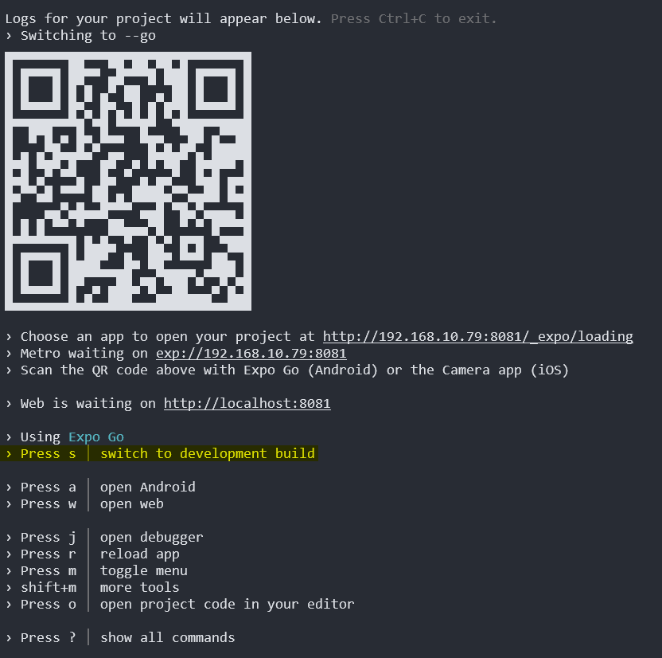
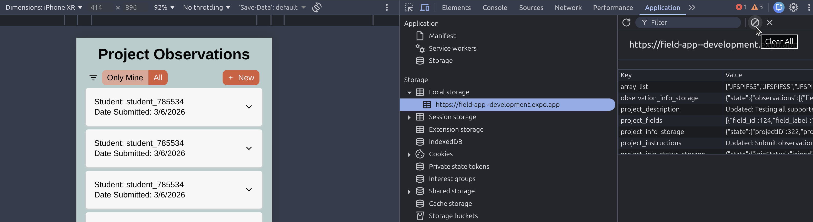
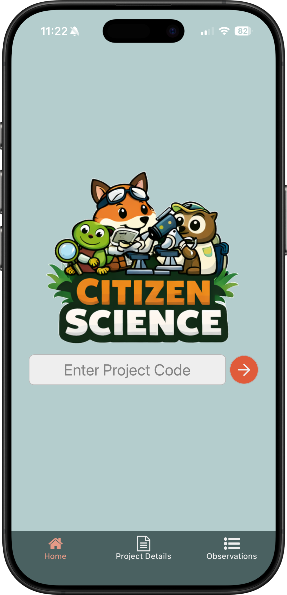
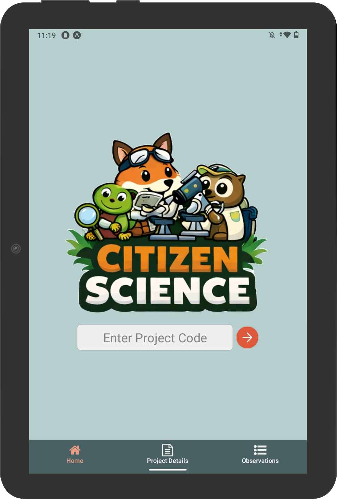
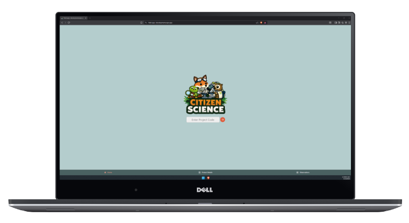

# Citizen Science App for Kids - Field App Repository

## Webhosted Version

For the fastest way to get started with this app, visit the [web hosted version](https://field-app--development.expo.app). If you would like to use the mobile version of the app, please use Expo Go via the instructions in the next section. Note: the instructions below can also be used to launch a localhost webserver version of the web app.

## Get started - Locally Hosted Version (iOS / Android / Web)

1. Clone this GitHub repository.

2. Install dependencies

   ```bash
   npm install
   ```

   To access the mobile version using ExpoGo, the ExpoGo app must be [downloaded and installed](https://expo.dev/go) on your device.

3. Start the app

   ```bash
   npm run start
   ```

4. Scan the QR Code

> Note: This should either open ExpoGo or a link prompting you whether you wish to open in ExpoGo. Once opened, the app will bundle and be available on your device for use. If this does not happen, switch to ExpoGo by entering 's' in the terminal and re-scan the code.



## Native Bundling

Expo can be used to bundle and test native application versions in a simulator or for loading into a test Android or iOS developer account. Please follow the instructions [here](https://docs.expo.dev/get-started/set-up-your-environment/?mode=development-build) for more details.

## Test Project

To test the Field App, a project code is required. If you do not want to create one through the Admin Website, you can use the following project code to test adding and editing observations.

> Please note that if you choose to include the location information with an observation, it will be stored in the backend database. This can be deleted via the Admin Website, however, this will require messaging me directly as the creator of the test project.

#### Test Project Code: LDMJHDJM

#### Admin Website [Hosted Link](https://citizen-science-app-for-kids-admin.vercel.app/) | [GitHub Repository](https://github.com/ekacala/Citizen-Science-App-for-Kids---Admin-Website-Frontend)

Creating an account on the Admin Website will generate a project code for you to test in the Field App. By doing this, you have control over deleting observations or the entire project when you are finished.

## Additional Notes:

- In order to test filter functionality, you will need to access the Field App via two different 'devices' (Expo Go Mobile & Web) or you can access on the web and clear the persistent storage in the browser before refreshing the app.



## User Interface Examples

<figure>
   
   <figcaption>iPhone 16 Pro (iOS)</figcaption>
</figure>

<figure>
   
   <figcaption>Lenovo TB-8505FS (Android)</figcaption>
</figure>

<figure>
   
   <figcaption>Dell Laptop - Brave Browser (Web)</figcaption>
</figure>

> NOTE: Above screenshots were taken from actual devices and inset on mock devices for demonstration. Links are included below for the tools used to generate the device frames:
> [iPhone](https://withfra.me/shot/iphone-16-pro)
> [Android](https://developer.android.com/distribute/marketing-tools/device-art-generator)
> [Laptop](https://deviceshots.com/)
